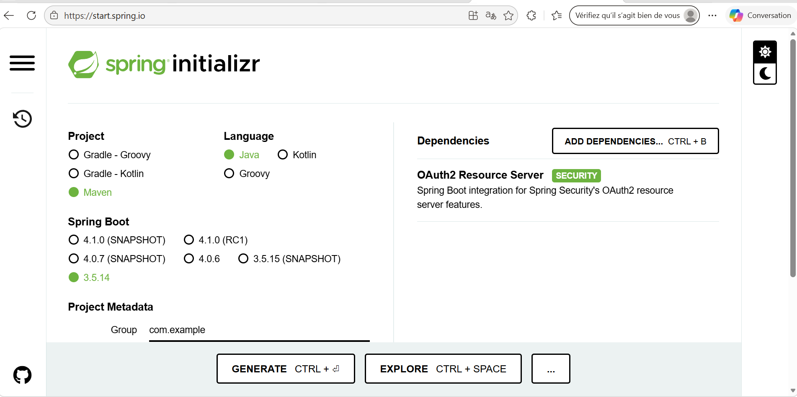
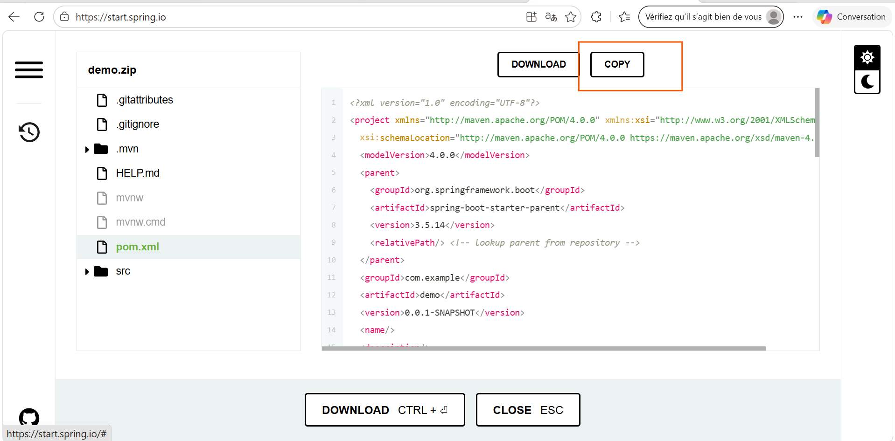
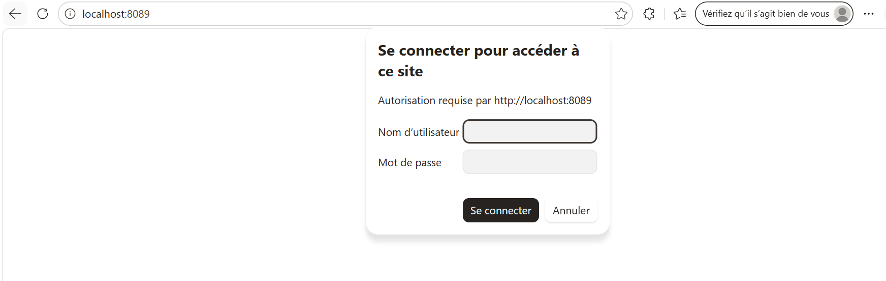
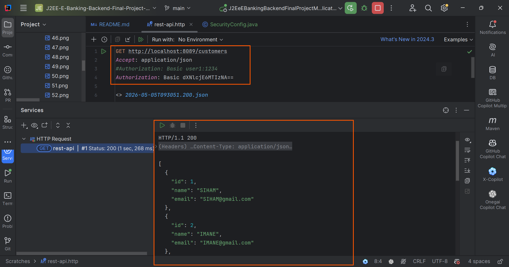
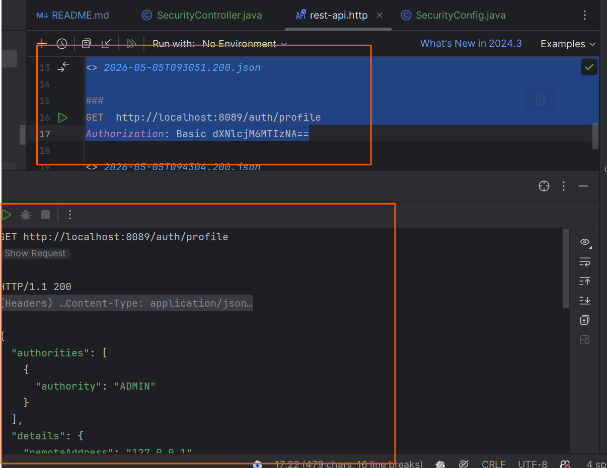
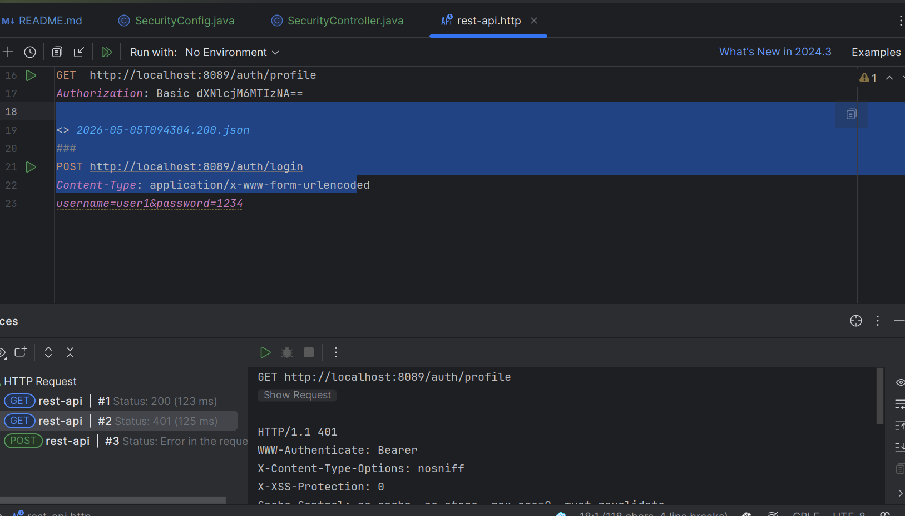
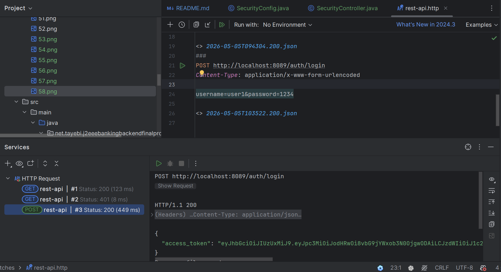
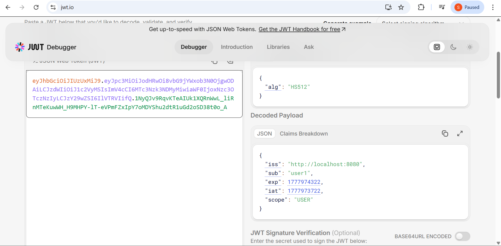

## 🚀 1ère étape : Ajouter les dépendances nécessaires
- Spring Web : permet de créer des applications web et de gérer les requêtes HTTP (controllers, APIs REST, etc.).
- Spring Data JPA : permet d'interagir facilement avec la base de données en utilisant des entités Java (ORM avec Hibernate).
- Lombok : bibliothèque qui réduit le code répétitif en générant automatiquement les getters, setters, constructeurs, etc.
- H2 Database : base de données en mémoire utilisée pour le développement et les tests.
- Spring Boot DevTools (optionnel) :
 * redémarrage automatique de l'application lors des modifications
 * rechargement automatique des fichiers HTML (Thymeleaf)
 * configuration optimisée pour le développement
## 💡 Remarques:
Avec DevTools, il n'est pas nécessaire de redémarrer l'application après chaque modification (surtout pour les fichiers HTML).
La console H2 peut être activée avec : spring.h2.console.enabled=true
Elle permet de visualiser les données de la base directement dans le navigateur.

## 🎯 Objectif

Mettre en place l'environnement de base nécessaire pour développer une application Spring Boot avec :

- une interface web
- une base de données
- une structure propre et maintenable

## 2ème étape : on passe à créer nos packages
entities
repositories 
services 
web
dtos
mappers
## On crée les entités
BankAccount
Customer
AccountOperation
CurrentAccount
SavingAccount
mapping c'est JPA
MongoDB pas entity mais document soit mapping objet relationnel ou mapping objet document

mapped by c'est-à-dire relation déjà présente dans une classe 
## On passe à l'héritage, ya 3 stratégies
- single table : une seule table contient tous les types de filles avec que l'attribut du fils non null
- table per class : là on a le nombre de tables selon le nombre de fils 
- table joined : là on a 3 tables, 1 mère et les fils ayant que les attributs personnels + id de la mère
## Après avoir créé toutes les entités et configuré notre fichier application.properties on lance l'application et voilà les tables sont créées avec succès

## On passe aux repositories où on va créer 3 interfaces
On crée accountBankRepository, 
accountOperationRepository et customerRepository 
et après on passe à injecter le customerRepository, accountRepo et operationRepo dans un CommandLineRunner avec l'annotation @Bean pour créer des customers dans la BD au démarrage de l'application
```java
@Bean
    CommandLineRunner commandLineRunner(CustomerRepository customerRepository, BankAccountRepository bankAccountRepository, CustomerRepository customerRepository2) {
        return args -> {
            Stream.of("Hassan","Imane","Siham").forEach(customer -> {
                Customer c=new Customer();
                c.setName(customer);
                c.setEmail(customer+"@gmail.com");
                customerRepository.save(c);
            });
        };
    }
```
Et voilà nos customers ajoutés avec succès 

Et voilà nos données ajoutées à bankAccount 

Là il y a un petit problème dans les enums, il stocke le numéro au lieu de la string, c'est pour cela on va ajouter
```java
@Enumerated(EnumType.STRING)
```
Et voilà le résultat

Maintenant on passe à créer des AccountOperation
avec le même principe 
et voilà ils sont créés dans notre BD

## On essaie la stratégie 2 : table per class
En mettant dans la classe mère 
```java

@Inheritance(strategy = InheritanceType.TABLE_PER_CLASS)
```
Voilà notre table CurrentAccount mais là il y a aussi la table BankAccount, la table de la classe mère 

En mettant aussi abstract dans la classe mère pour que Hibernate ne la crée pas

```java
public abstract class  BankAccount {
    //...............
}
```
Là il n'y a pas de BankAccount, la classe mère est abstraite c'est pour cela qu'Hibernate ne va pas la générer automatiquement 


## Maintenant on passe à la 3ème stratégie : Joined Table 
Là on met dans la classe mère 
```java
@Inheritance(strategy = InheritanceType.JOINED)

```
Là on a 3 tables : la mère et les deux fils
1ère table

2ème table

3ème table


## On retourne vers Single Table car c'est lui le plus pratique dans ce cas car il y a qu'un attribut dans une seule classe dérivée
## On bascule aussi vers MySQL, on change la dépendance H2 avec celle de MySQL
```xml
<dependency>
            <groupId>com.mysql</groupId>
            <artifactId>mysql-connector-j</artifactId>
            <scope>runtime</scope>
        </dependency>
```
On change aussi les configs dans application.properties 
```xml
spring.application.name=J2EE-E-Banking-Backend-Final-Project-Module
spring.datasource.url=jdbc:h2:mem:bank-db
spring.h2.console.enabled=true
server.port=8089
spring.datasource.username=sa
spring.datasource.password=

```
On met 
```xml
spring.application.name=J2EE-E-Banking-Backend-Final-Project-Module
spring.datasource.url=jdbc:mysql://localhost:3306/bank-db?createDatabaseIfNotExist=true
server.port=8089
spring.jpa.properties.hibernate.dialect=org.hibernate.dialect.MariaDBDialect
spring.jpa.hibernate.ddl-auto=update
spring.jpa.show-sql=true
spring.datasource.username=root
spring.datasource.password=

```
Et voilà notre BD MySQL est créée avec succès

On passe à modifier un account par son id
## C'est important de choisir le fetch dans l'élément ayant mappedBy, soit eager ou lazy. Lazy charge à la demande mais eager charge en chargeant les données en même temps


## 2ème solution : c'est utiliser les services avec @Transactional et injecter le service dans le CommandLineRunner et ça va marcher même avec lazy


## On intègre l'API SLF4J pour intégrer de la journalisation dans mes services
## On passe à créer les exceptions personnalisées comme CustomerNotFoundException dans le package des exceptions
Une RuntimeException = une erreur qui se produit pendant l'exécution du programme
RuntimeException = erreur causée par un problème dans le code (logique)
👉 Java ne t'oblige pas à la gérer
Exception surveillée → tu dois gérer
👉 Exception non surveillée → tu peux gérer, mais pas obligé
Non surveillée hérite de RuntimeException et ce n'est pas la peine de try catch ou throws 
mais surveillée nécessite throws ou try catch et hérite de Exception
## On implémente toutes les méthodes du service et on crée des classes d'exceptions personnalisées et non surveillées c'est-à-dire qui héritent de RuntimeException
# ON continue avec les méthodes de credit, debit et virement 
## On teste nos méthodes via CommandLineRunner avec @Bean pour le lancer automatiquement
```java
@Bean
CommandLineRunner commandLineRunner(BankAccountService bankAccountService){

    return args -> {
 // ajouter une liste de customers à la table des customers
            Stream.of( "SIHAM","IMANE","ALI","HASAN","FOUZIA","HAMID").forEach(
        nom->{
Customer customer=new Customer();
                        customer.setName(nom);
                        customer.setEmail(nom+"@gmail.com");

                        bankAccountService.saveCustomer(customer);
                    }
                            );
                            bankAccountService.listCustomers().forEach(customer->
        {
        try {
        bankAccountService.saveCurrentBankAccount(Math.random()*90000,9000,customer.getId());
        bankAccountService.saveSavingBankAccount(Math.random()*120000,5.5,customer.getId());
List<BankAccount> bankAccounts= bankAccountService.listBankAccounts();
                    for(BankAccount account:bankAccounts){
        for (int i=0; i<10;i++){
        bankAccountService.debit(account.getId(), Math.random()*10000,"Debit"+(i+1));
        bankAccountService.credit(account.getId(), Math.random()*9000,"Credit"+(i+1));

        }
        }
        } catch (CustomerNotFoundException | BankAccountNotFoundException | BalanceNotSufficientException e) {
        e.printStackTrace();
                }
                        });


```
On change ddl Hibernate en create pour vérifier si ça marche
Et voilà notre table des customers bien ajoutée


## On a fini avec la couche service, on passe à la couche web
## On passe à la couche web REST API
On crée CustomerRestController
On ajoute la route /customers
Là on affiche les résultats de la requête 

Ça c'est parce qu'on a dans Customer un @OneToMany, pour résoudre le problème on va ajouter @JsonProperty
```java
@JsonProperty(access = JsonProperty.Access.WRITE_ONLY)
```
Il va sérialiser nom, email et la liste des comptes. Il va retourner les comptes puis il va voir qu'un compte appartient à un customer, il va l'afficher puis le compte puis le customer. C'est pour cela on fait @JsonProperty, c'est-à-dire quand je consulte un client pas besoin de consulter la liste des comptes.
On dit à l'API qui convertit en JSON : ce n'est pas la peine de sérialiser les comptes du user en mode lecture

@JsonProperty c'est pour ignorer en lecture ou écriture et @JsonIgnore pour ignorer tout
#### DTOS
👉 DTO = Data Transfer Object

➡️ C'est une couche de classes qui servent uniquement à transporter des données entre :

le client (frontend / API)
le backend (services, controllers)
Et le Mapper c'est pour transformer une entité en DTO ou l'inverse
Voici une méthode d'exemple
```java
public CustomerDTO fromCustomer(Customer customer) {
        CustomerDTO customerDTO = new CustomerDTO();
        customerDTO.setId(customer.getId());
        customerDTO.setName(customer.getName());
        customerDTO.setEmail(customer.getEmail());
        return customerDTO;
    }
```
Au lieu de faire set/get il y a une méthode qui copie les propriétés d'un objet dans un autre
```java

        BeanUtils.copyProperties(customer, customerDTO);
```
Il y a aussi MapStruct qui génère tout
```java
nous on définit que la classe, lui il génère via MapStruct
```

Après avoir créé notre REST controller
```java
package net.tayebi.j2eeebankingbackendfinalprojectmodule.web;

import lombok.AllArgsConstructor;
import lombok.extern.slf4j.Slf4j;
import net.tayebi.j2eeebankingbackendfinalprojectmodule.dtos.CustomerDTO;
import net.tayebi.j2eeebankingbackendfinalprojectmodule.entities.Customer;
import net.tayebi.j2eeebankingbackendfinalprojectmodule.exceptions.CustomerNotFoundException;
import net.tayebi.j2eeebankingbackendfinalprojectmodule.services.BankAccountService;
import org.springframework.web.bind.annotation.GetMapping;
import org.springframework.web.bind.annotation.PathVariable;
import org.springframework.web.bind.annotation.RequestMapping;
import org.springframework.web.bind.annotation.RestController;

import java.util.List;

@RestController
@AllArgsConstructor
@Slf4j
//@RequestMapping("/customers") c'est-à-dire il faut mettre ça avant les routes d'ici pour y accéder
public class CustomerRestController {
    BankAccountService bankAccountService;
    @GetMapping("/customers")
    public List<CustomerDTO> customers(){
        return bankAccountService.listCustomers();
    }
    @GetMapping("customers/{id}")
    public CustomerDTO customer(@PathVariable(name = "id") Long id) throws CustomerNotFoundException {
        return  bankAccountService.getCustomer(id);

    }

}


```
On teste

C'est bon, on a mis customers/{id} et ça a retourné le customer avec l'id 1

```java

    @PostMapping("/customers")
    public CustomerDTO createCustomer(@RequestBody CustomerDTO customerDTO) {

        return bankAccountService.saveCustomer(customerDTO);
    }

}
```
Après avoir ajouté cette route d'ajout, comme elle est POST pas GET on ne peut pas la tester avec le navigateur, on va la tester avec Postman


On dit à Postman dans la route POST de /customers pour ajouter un nouveau customer dans le header 

On a essayé d'ajouter un nouveau customer

Et voilà c'est bien ajouté

On teste si tous nos customers sont là avec la route GET /customers


On fait la méthode de mise à jour
Là on a créé un RESTful controller ou REST API controller
## On fait update à l'adresse mail de Jalal avec jalal2@gmail.com

## On teste le delete et on supprime Brahim par exemple

## On ajoute la dépendance de Swagger pour rendre notre web service consommable via une interface, c'est-à-dire on crée une API à partir de notre web service


## On teste nos routes depuis l'interface Swagger
## On teste GET /customers


## POST /customers


## GET /customers/{id}

## DELETE /customers/{id}


## PUT /customers/{customerId}


C'est ça notre documentation Swagger REST API
Et pour consulter la documentation de notre API RESTful on va taper 
```thymeleafurlexpressions
http://localhost:8089/v3/api-docs
```
qui décrit notre API RESTful


À partir de ce doc on peut générer des classes, car ça décrit l'interface du web service c'est-à-dire les différentes opérations et ce qu'il veut en input et quoi en output.
Car si on veut créer une application et communiquer avec ce web service il suffit d'avoir ce doc et à partir de lui on peut générer des classes à partir des outils générateurs.
Pour que si quelqu'un veut l'utiliser il doit lire que ça sans vous interroger sur comment ça marche.
Et on peut le consommer directement via Postman, on met import et on met l'URL http://localhost:8089/v3/api-docs
puis on valide 
  
Et voilà il nous a créé une OpenAPI doc définition avec toutes les opérations à tester automatiquement


Voilà GET /customers automatique
 Il y a toutes les routes à tester automatiquement
Maintenant à chaque fois que j'ajoute des web services ils seront ajoutés automatiquement
### Maintenant on passe à la partie des comptes avec virement, débit, crédit etc
## On crée un autre BankAccountRestController

## On crée une classe BankAccountDTO qui sera utilisée pour transférer les données du REST API/controllers au frontend pour ne transférer que les données dont on aura besoin

## Après avoir créé la route qui récupère toutes les opérations d'un compte
```java
package net.tayebi.j2eeebankingbackendfinalprojectmodule.web;

import lombok.AllArgsConstructor;
import net.tayebi.j2eeebankingbackendfinalprojectmodule.dtos.AccountOperationDTO;
import net.tayebi.j2eeebankingbackendfinalprojectmodule.dtos.BankAccountDTO;
import net.tayebi.j2eeebankingbackendfinalprojectmodule.entities.BankAccount;
import net.tayebi.j2eeebankingbackendfinalprojectmodule.exceptions.BankAccountNotFoundException;
import net.tayebi.j2eeebankingbackendfinalprojectmodule.services.BankAccountService;
import org.springframework.web.bind.annotation.GetMapping;
import org.springframework.web.bind.annotation.PathVariable;
import org.springframework.web.bind.annotation.RestController;

import java.util.List;

@RestController
// pour faire l'injection des dépendances
@AllArgsConstructor
public class BankAccountRestController {
    private BankAccountService bankAccountService;
    @GetMapping("/accounts/{accountId}")
    public BankAccountDTO getBankAccount(@PathVariable String accountId) throws BankAccountNotFoundException {
        return  bankAccountService.getBankAccount(accountId);
    }
        @GetMapping("/accounts")
    public List<BankAccountDTO> listAccounts(){
        return bankAccountService.listBankAccounts( );

    }
    @GetMapping("/accounts/{accountId}/operations")
    public List<AccountOperationDTO> getHistory(@PathVariable  String accountId){
        return bankAccountService.accountHistory(accountId);

    }


}

```
## Nous avons aussi configuré l'endpoint pour consulter un compte avec son id


## Nous avons testé via le navigateur

## On passe à faire la pagination
```java
@Override
    public AccountHistoryDTO getAccountHistory(String accountId, int page, int size) throws BankAccountNotFoundException {
        BankAccount bankAccount=bankAccountRepository.findById(accountId).orElse(null);
        if(bankAccount == null) {
            throw new BankAccountNotFoundException("Bank Account Not Found");
        }
     Page<AccountOperation> accountOperations= accountOperationRepository.findByBankAccountId(accountId,  PageRequest.of(page,size));
     AccountHistoryDTO accountHistoryDTO=new AccountHistoryDTO();
     List<AccountOperationDTO> accountOperationsDto=accountOperations.getContent().stream().map(op->bankAccountMapper.fromAccountOperation(op)).collect(Collectors.toList());

     accountHistoryDTO.setAccountHistoryDTOList(accountOperationsDto);
     accountHistoryDTO.setAccountId(bankAccount.getId());
     accountHistoryDTO.setBalance(bankAccount.getBalance());
     accountHistoryDTO.setCurrentPage(page);
     accountHistoryDTO.setPageSize(size);
     accountHistoryDTO.setTotalPages(accountOperations.getTotalPages());
        return accountHistoryDTO;
    }
}
```

```java
@GetMapping("/accounts/{accountId}/pageOperations")
    public AccountHistoryDTO getAccountHistory(@PathVariable  String accountId , @RequestParam (name = "page", defaultValue = "0") int page, @RequestParam (name = "size", defaultValue = "5")  int size) throws BankAccountNotFoundException {
        return bankAccountService.getAccountHistory(accountId, page,size);

    }
```


## On affiche la page 2

## On affiche la page 2 size 3


## Voici tous nos endpoints 


## ON passe au frontend
## Là on va utiliser Angular
# On va installer nos outils via la commande  
## Pour créer nos applications
## Installation de Angular CLI qui permet de :
Créer un projet Angular avec ng new
Lancer un serveur via ng serve
Générer des composants via ng generate component
Builder l'application avec ng build

```text
npm install -g @angular/cli 
```
On crée un nouveau projet via 
```text
ng new e-banking-app-j2ee
```

On ajoute la route search
http://localhost:8089/customers/search?keyword=SIHAM
Voilà son test, ça marche 
On teste sans mettre aucun nom et ça va afficher tous les customers

http://localhost:8089/customers/search


On teste avec http://localhost:8089/customers/search?keyword=H


## Nous avons passé à la partie sécurité, nous avons commencé par installer la dépendance à partir de https://start.spring.io/ et la coller dans notre pom.xml
```text
OAuth2 Resource Server Security
Spring Boot integration for Spring Security's OAuth2 resource server features.
```


## Là l'authentification sera autorisée par défaut
# Nous avons créé une classe de configuration personnalisée
## Dans la classe config il y a 2 annotations importantes : @Configuration et @EnableSecurityWeb
## Dans la classe SecurityConfig on met l'authentification via un formulaire basic

## On teste via HTTP Client Tools de IntelliJ dans Tools > HTTP Client > Test, nous avons installé le plugin Base64 Helper pour encoder nos données
Nous avons testé les 3 users et ça marche
```http request
GET http://localhost:8089/customers
Accept: application/json
#Authorization: Basic user1:1234
#Authorization: Basic dXNlcjE6MTIzNA==
#Authorization: Basic user2:1234
Authorization: Basic dXNlcjI6MTIzNA==
#Authorization: Basic user3:1234
#Authorization: Basic dXNlcjM6MTIzNA==

<> 2026-05-05T093403.200.json
<> 2026-05-05T093051.200.json

###
```

## Nous avons créé un SecurityController

```java
 @GetMapping("/profile")
    public Authentication authenticate(Authentication authentication) {
        return authentication;
    }
```
On teste aussi une méthode qui retourne l'objet d'authentification

## Nous avons aussi remplacé l'authentification par défaut avec OAuth2 Resource Server configuré
## Pour JWT encoder et decoder on a besoin d'une secretKey, nous avons mis notre secret dans application.properties
## Dans la config on déclare une variable où on va appeler cette secretKey
Endpoint pour authentifier les users
```java
 @PostMapping("/login")

    public Map<String,String > login(String username, String password) {
        Authentication authentication=authenticationManager.authenticate(new UsernamePasswordAuthenticationToken(username, password));
        // génère les JWT
        Instant instant = Instant.now();
        String scope=authentication.getAuthorities().stream().map(a->a.getAuthority()).collect(Collectors.joining(""));

        JwtClaimsSet jwtClaimsSet=JwtClaimsSet.builder()
                .issuedAt(instant)
                .expiresAt(instant.plus(10, ChronoUnit.MINUTES))
                .subject(username)
                .issuer("http://localhost:8080") // qui a généré le token
                .claim("scope", scope)
                .build();
        //encoder en rappelant quel algorithme
        JwtEncoderParameters jwtEncoderParameters=JwtEncoderParameters.from(
                JwsHeader.with(MacAlgorithm.HS512).build(),jwtClaimsSet);
        String jwt = jwtEncoder.encode(jwtEncoderParameters).getTokenValue();
        return Map.of("access_token",jwt);

    }
```
Nous avons testé l'endpoint
via IntelliJ 
## Soit on l'a testé, là on va être rejeté car nous on demande que toutes les requêtes doivent être des users authentifiés 

# Donc nous avons autorisé tout cet endpoint
```java
                .authorizeHttpRequests(ar-> ar.requestMatchers("/auth/login/**").permitAll())

```
Nous avons testé l'authentification, il nous a envoyé le token JWT et on l'a décodé et bien les données sont correctes



Pour les autres endpoints non autorisés sans authentification, il faut envoyer avec la requête dans le header Authorization + le secret JWT généré sinon ça va pas marcher
mais avec Bearer au lieu de Basic
## Nous avons protégé tout ce qui est GET avec le rôle USER et tout ce qui est PUT/DELETE etc avec le rôle ADMIN
```java

@EnableGlobalMethodSecurity(prePostEnabled = true) 
dans config et dans les controllers on met
@PreAuthorize("hasRole('USER')")
```
## Nous revenons à protéger notre frontend
